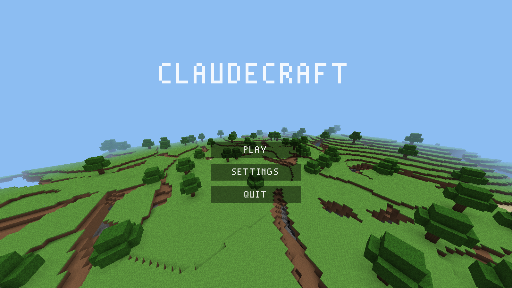
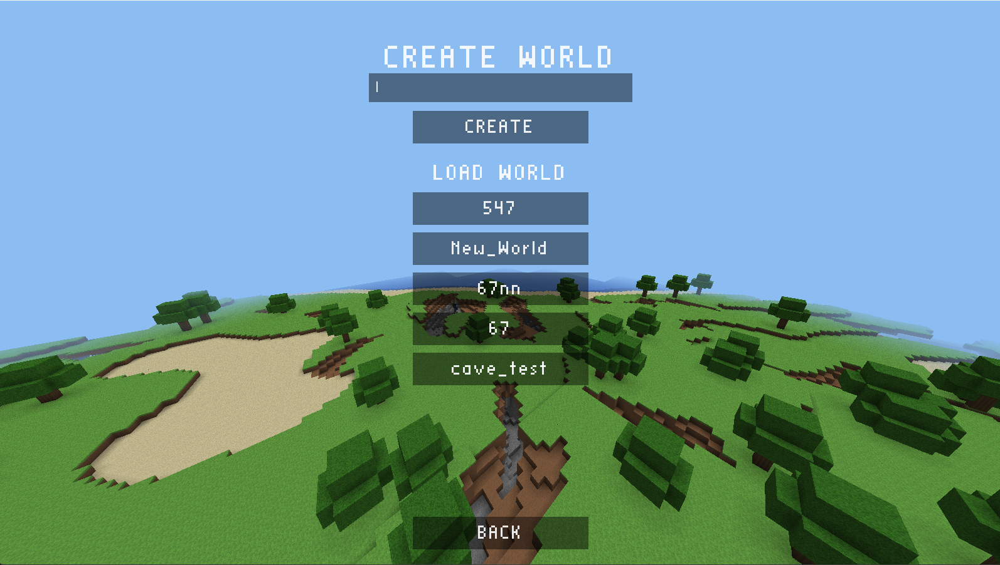

# claudecraft



A Minecraft-style voxel game in modern C++20. OpenGL 3.3 core via GLFW + GLAD, GLM math, stb_image textures. No engine, no CMake — the build is two `cl.exe` invocations driven by `.vscode/tasks.json`.

## Setup

1. Install Visual Studio (Community is fine) with the "Desktop development with C++" workload.
2. Open **x64 Native Tools Command Prompt for VS** (so `cl.exe` is on `PATH`), `cd` to this folder, run `code .`.
3. Build: `Ctrl+Shift+B` (debug) or run the `build (release)` task.
4. Run/debug: `F5` (builds first, launches under the MSVC debugger).

Output lands in `build/debug/claudecraft.exe` / `build/release/claudecraft.exe`. The exe must run with the project root as working directory (it loads `shaders/`); `launch.json` already sets that.

If your MSVC version differs, update `compilerPath` in `.vscode/c_cpp_properties.json` — the build tasks don't care, they use whatever `cl` is on `PATH`.



## Controls

| Input | Action |
|---|---|
| WASD + mouse | Move / look |
| Space | Jump (walk) / ascend (fly) |
| Left Shift | Descend (fly) / crouch (on foot: slower, lower hitbox, won't walk off ledges) |
| F | Toggle fly (creative only) |
| Left / right click | Break / place block (survival: hold to mine, blocks drop) |
| 1–9, scroll wheel | Select hotbar slot |
| Q | Drop one of the selected item (thrown along your view) |
| E | Inventory (creative gets an infinite ALL BLOCKS palette) |
| F3 | Debug overlay (fps, position, light, biome, target, chunk stats, CPU/GPU/RAM) |
| G | Toggle chunk-border wireframe |
| Esc | Close inventory / pause menu (resume / settings / quit to menu) |

The game opens on a main menu with a randomly seeded terrain fly-over in the background. Play leads to the worlds screen: type a name, pick creative or survival, and CREATE (random seed) — or load an existing world from the list. Worlds have a persistent day/night cycle, inventory, caves with ores, and biomes (plains, forest, desert, mountains, ocean). Pause quits back to the menu. The window title shows the world, FPS, position, and loaded/drawn chunk counts.

Settings (from the main menu or pause) has VIDEO (render distance, FOV, vsync, fullscreen), CONTROLS (mouse sensitivity, invert Y, rebindable movement + hotbar keys in two columns), PACKS (enable/disable/reorder Minecraft resource packs at runtime) and CHEATS (player speed multiplier, block reach) categories; values apply immediately and persist to `settings.txt`.

## Architecture

```
src/
  Main.cpp            entry point; catches and logs init failures
  app/                Window (GLFW+GLAD RAII), Application (composition root, game loop)
  core/               ThreadPool (jthread), ConcurrentQueue, logging
  gl/                 move-only RAII wrappers (Buffer/VertexArray/Texture2D),
                      ShaderProgram (compile/link checked), KHR_debug hookup
  input/              Input (polled view over GLFW callbacks)
  player/             Camera (matrices), Player (swept-AABB physics, fly/walk)
  render/             Renderer (chunk GPU meshes, frustum culling, water pass,
                      block highlight), TextureAtlas, Frustum, Hud (immediate-
                      mode overlay: rects/icons + stb_easy_font text, one
                      batched draw per frame)
  world/              Chunk (16x16x256, contiguous), World (streaming pipeline),
                      ChunkMesher (greedy meshing + AO), TerrainGenerator (Perlin
                      fBm, biomes, caves, ores, trees), WorldSave (RLE, versioned),
                      WorldList (named worlds + meta), Raycast (DDA)
shaders/              GLSL 330: chunk, hud, lines
third_party/          vendored GLFW 3.4 (+ glfw3.lib), GLAD, GLM 1.0.1, stb_image
```

### Threading model

All OpenGL stays on the main thread. Each frame, `World::update`:

1. integrates finished chunks from the generation queue,
2. saves + evicts chunks outside `renderDistance + 2`,
3. submits missing chunks (nearest first) to the worker pool — workers load the chunk from disk or generate it,
4. submits mesh jobs for dirty chunks whose 8 lateral neighbours are loaded; the job input is an immutable 18x18x256 snapshot copied on the main thread, so workers share nothing,
5. drains finished meshes and returns them as `WorldUpdate` for the renderer to upload.

Stale results are handled with a per-chunk mesh revision: every edit bumps it, every mesh job carries the revision it was built from, and mismatched results are dropped (the mismatch also keeps the chunk scheduled for a rebuild). `World`'s destructor waits for its in-flight jobs before the members they reference die.

### Meshing

Greedy meshing per face direction: each slice builds a mask of visible faces (face culled when the neighbour is opaque), then merges equal rectangles. Equality includes the 4-corner ambient-occlusion values, so merged quads keep correct shading; quads are split along the brighter diagonal to avoid AO anisotropy. Texcoords are emitted in block units and wrapped with `fract()` in the fragment shader — that's what lets one greedy quad tile a single atlas cell across many blocks (nearest filtering, no mips, no bleed). Water goes into a second translucent mesh, drawn back-to-front with depth writes off.

### World persistence

Each world lives in `saves/<name>/` with a `world.meta` (format version + seed). Only modified chunks are written: `c_<x>_<z>.bin`, an 8-byte magic+version header followed by RLE runs. Corrupt or version-mismatched files are ignored and the chunk regenerates. Saving happens on eviction, on quit-to-menu, and on exit.

### Textures

`render/TextureAtlas` loads, in order: a **Minecraft resource pack stack** (drop any vanilla `.zip` packs into `texture_packs/`, then enable/order them in Settings → PACKS — each block texture comes from the highest pack that has it, with grass/foliage/water tinted and animated textures' first frame taken; anything no pack supplies shows magenta), then a prebuilt `textures/atlas.png`, then a deterministic procedural atlas so the repo needs no binary assets. Block ids match Minecraft exactly (`grass_block`, `oak_log`, …). See [docs/rendering.md](docs/rendering.md).

## Further reading

Subsystem docs live in [docs/](docs/README.md): architecture, build system, threading model, meshing, rendering, and the save format.
