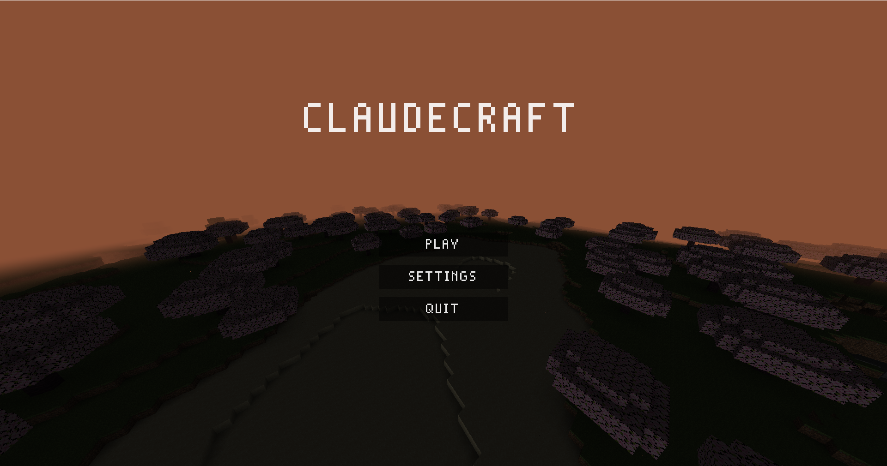
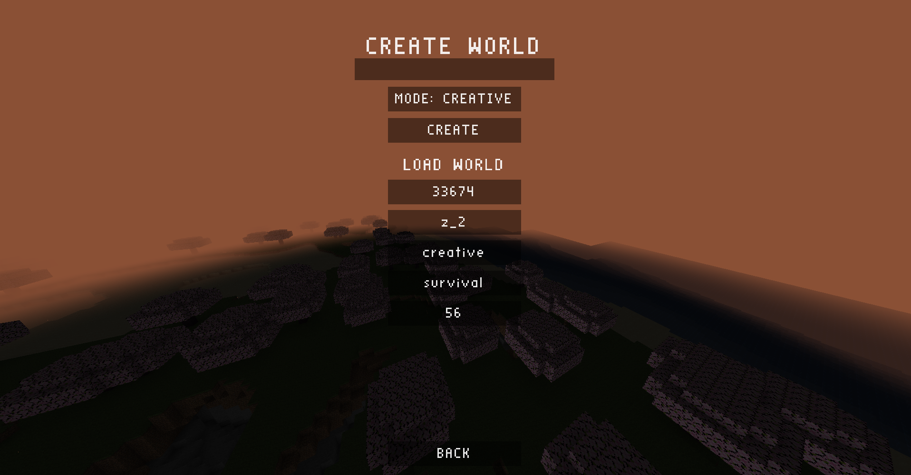
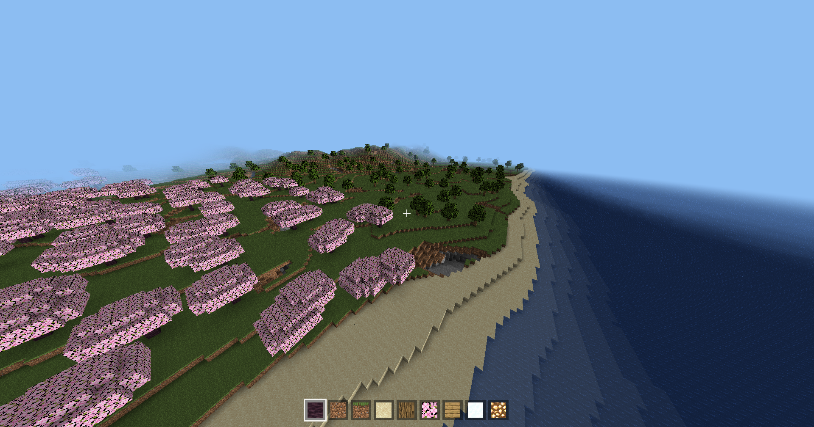
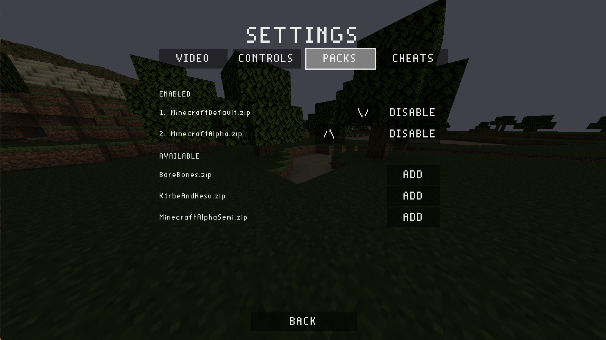

# claudecraft



A Minecraft-style voxel game in modern C++20 — infinite streamed terrain, day/night, caves, ores, biomes, survival/creative modes, and full Minecraft resource-pack support. OpenGL 3.3 core via GLFW + GLAD, GLM math, stb_image. No engine, no CMake — the build is two `cl.exe` invocations driven by `.vscode/tasks.json`.

## Setup

1. Install Visual Studio (Community is fine) with the "Desktop development with C++" workload.
2. Open **x64 Native Tools Command Prompt for VS** (so `cl.exe` is on `PATH`), `cd` to this folder, run `code .`.
3. Build: `Ctrl+Shift+B` (debug) or run the `build (release)` task.
4. Run/debug: `F5` (builds first, launches under the MSVC debugger).

Output lands in `build/debug/claudecraft.exe` / `build/release/claudecraft.exe`. Run with the project root as working directory (it loads `shaders/` from there); `launch.json` already sets that. If your MSVC version differs, update `compilerPath` in `.vscode/c_cpp_properties.json` — the build tasks don't care, they use whatever `cl` is on `PATH`.



## Playing

The game opens on a main menu with a randomly seeded terrain fly-over behind it. PLAY leads to the worlds screen: type a name, pick **creative** or **survival**, and CREATE (random seed) — or reload an existing world. Each world keeps a persistent day/night cycle, your inventory, and its game mode.

| Input | Action |
|---|---|
| WASD + mouse | Move / look |
| Space | Jump (walk) / ascend (fly) |
| Left Shift | Sprint (move faster) |
| Left Ctrl | Descend (fly) / crouch (on foot: slower, lower hitbox, won't walk off ledges) |
| F | Toggle fly (creative only) |
| Left / right click | Break / place block (survival: hold to mine, blocks drop) |
| 1–9, scroll wheel | Select hotbar slot |
| Q | Drop one of the selected item (thrown along your view) |
| E | Inventory (creative gets an infinite ALL BLOCKS palette) |
| F3 | Debug overlay (fps, position, light, biome, target, chunk stats, CPU/GPU/RAM) |
| G | Toggle chunk-border wireframe |
| Esc | Close inventory / pause menu (resume / settings / quit to menu) |

Settings (main menu or pause) spans four tabs, all applied live: **VIDEO** (render distance, FOV, vsync, fullscreen, smooth lighting), **CONTROLS** (mouse sensitivity, invert Y, and every key — movement *and* the nine hotbar slots — rebindable in two columns), **PACKS** (the resource-pack stack, below) and **CHEATS** (player-speed multiplier, block reach).

## Biomes & world generation



Everything in a world is a pure function of its seed, so the same seed always rebuilds the same world no matter what order chunks load in. Terrain starts from a single **continental** noise field that drives both extremes at once — high pushes up into **mountains**, low sinks into **ocean** basins — which means coastlines naturally pass through plains-height ground and mountains can never sit inside the sea.

The flatter lowlands between those extremes are split by climate: **temperature** carves out cold **taiga** and warm, wet **cherry grove**, and what's left splits by **moisture** into dry **desert**, lush **forest**, or default **plains**.

| Biome | Look | Trees |
|---|---|---|
| Plains | grass, gentle hills | sparse oak |
| Forest | grass | dense oak |
| Taiga | grass, cold | tall conical spruce |
| Cherry grove | grass, warm & wet | broad pink cherry canopies |
| Desert | sand all the way down | none |
| Mountains | grass, snow caps above y≈108 | none | 
| Ocean | sand floor under water to sea level (62) | none |

Underground, two 3D noise fields intersect to carve winding **spaghetti caves** (tunnels, not blobs), and a single shared ore field clusters **coal → iron → gold → diamond** into natural veins, each gated to its own depth band so diamond cores sit deep with gold and iron shelling outward. Beaches stay sandy near sea level regardless of biome, and trees keep a margin inside their chunk so canopies never straddle a border. Full thresholds and tuning knobs are in [docs/terrain.md](docs/terrain.md).

## Saving

All writable data lives in one per-user folder: **`%LOCALAPPDATA%/.claudecraft/`**, holding `saves/`, `settings.txt` and `texture_packs/`. (If you ran an older build that wrote into the game folder, that data is moved into place automatically on first launch.) Only `shaders/` is still read from the install directory.

Each world is a directory `saves/<name>/`, and worlds are **sparse** — only chunks you've actually changed get written, as `c_<x>_<z>.bin` (a small magic+version header followed by run-length-encoded blocks), so a freshly explored but untouched world costs almost nothing on disk. A `world.meta` stores the seed, time of day and game mode; `player.dat` stores your inventory. Saving happens when a chunk streams out of range, on quit-to-menu, and on exit. Corrupt or version-mismatched chunk files are ignored and simply regenerate from the seed, so a bad write never bricks a world. Format spec: [docs/save-format.md](docs/save-format.md).

## Texture packs

claudecraft loads **real Minecraft resource packs**. Drop any vanilla pack — `.zip` or an extracted folder — into `%LOCALAPPDATA%/.claudecraft/texture_packs/`, then open **Settings → PACKS** to enable, disable and reorder them at runtime (no restart).



Packs **stack** exactly like Minecraft's: for each block, the texture comes from the highest enabled pack that provides it, so you can layer a small override on top of a base pack. Block ids match Minecraft exactly (`grass_block`, `oak_log`, `diamond_ore`, …), so a pack's textures resolve by name with no remapping. The loader handles the Minecraft details too: greyscale grass/foliage/water get tinted, animated textures (like water) use their first frame, and HD packs are downscaled to the atlas. Anything no enabled pack supplies shows up **magenta** so a missing texture is obvious. With no packs enabled it falls back to a bundled `textures/atlas.png`, then to a built-in procedural atlas — so the game always runs, even with no art assets at all.

## Under the hood

The heavy lifting is a streaming pipeline: the main thread owns all OpenGL, while a worker pool generates terrain and builds **greedy-meshed** chunk geometry (with ambient occlusion and a separate translucent water pass) from immutable snapshots, so workers share no mutable state. Chunks stream in nearest-first and evict — saving if dirty — past the render distance.

```
src/
  app/      Window (GLFW+GLAD RAII), Application (composition root, game loop)
  core/     ThreadPool, ConcurrentQueue, logging, Paths (data dir), SystemStats
  gl/       move-only RAII handles, shader compile/link checking, KHR_debug
  input/    polled view over GLFW callbacks
  player/   Camera, Player (swept-AABB physics, fly/walk/crouch)
  render/   Renderer, TextureAtlas (+ resource packs), Frustum, Hud, Sky
  world/    Chunk, World (streaming), ChunkMesher, TerrainGenerator, LightEngine,
            WorldSave/WorldList, Drops, Raycast
```

Per-subsystem docs — architecture, threading, meshing, lighting, terrain, rendering, save format — live in [docs/](docs/README.md).
